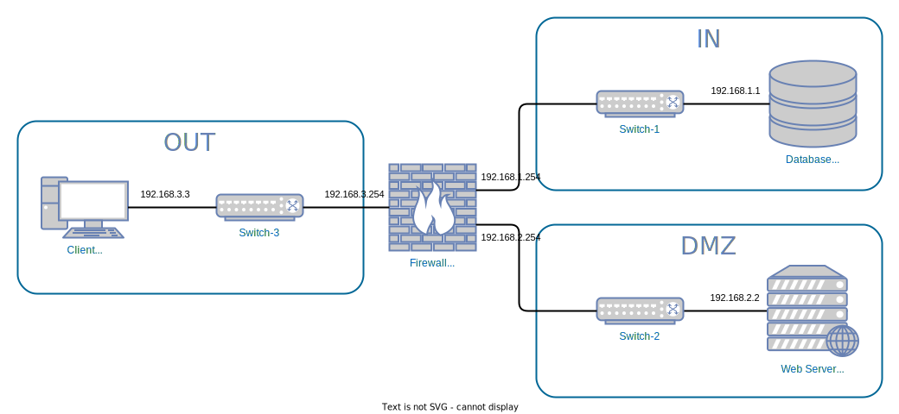

# A29 BlingBank Project Read Me

## Team

| Number | Name              | User                               | E-mail                                        |
| -------|-------------------|------------------------------------| ----------------------------------------------|
| 99180  | André Caseiro     | <https://github.com/andrevcaseiro> | <mailto:andre.v.caseiro@tecnico.ulisboa.pt>   |
| 99258  | Jorge Santos      | <https://github.com/JJSantos22>    | <mailto:jorge.m.santos@tecnico.ulisboa.pt>    |
| 99085  | Ivan Fortes       | <https://github.com/ivanfortes24>  | <mailto:ivantfortes@tecnico.ulisboa.pt>       |

  

## Contents

This repository contains documentation and source code for the *Network and Computer Security (SIRS)* project.

The [REPORT](REPORT.md) document provides a detailed overview of the key technical decisions and various components of the implemented project.
It offers insights into the rationale behind these choices, the project's architecture, and the impact of these decisions on the overall functionality and performance of the system.

This document presents installation and demonstration instructions.

## Installation

To see the project in action, it is necessary to setup a virtual environment, with 3 networks and 4 machines.  

The following diagram shows the networks and machines:



### Prerequisites

All the virtual machines are based on: Linux 64-bit, Kali 2023.3  

[Download](https://www.kali.org/get-kali/#kali-platforms) and [install](https://www.kali.org/docs/virtualization/install-virtualbox-guest-vm/) a virtual machine of Kali Linux 2023.3.  
Clone the base machine to create the other machines.

To connect VM1 and VM4 in the same network, do the following in the VirtualBox interface with the VM turned off:

Select the VM Settings/Network/Adapter1
Attach to Internal Network. Call it "sw-1"
Promiscuous Mode: Allow VMs
Repeat for VM2 and VM4 but this time creating a second Network adapter in VM4 and calling the Internal Network "sw-2". Repeat another time for VM3 and VM4, creating a third Network adapter in VM4 and calling the Internal Network "sw-3".

### Machine configurations

For each machine, there is an initialization script with the machine name, with prefix `init-` and suffix `.sh`, that installs all the necessary packages and makes all required configurations in the a clean machine. You may need to run `chmod 777 *.sh` to have permissions to run the script.

Inside each machine, use Git to obtain a copy of all the scripts and code.

```sh
$ git clone https://github.com/tecnico-sec/a29-ivan-jorge-andre
```

Next we have custom instructions for each machine.

#### Machine 1

This machine runs a PostgresSQL 16.1 database server.

#### Machine 2

This machine runs our web server.

To test:

```sh
$ cd BlingBankServer
$ mvn spring-boot:run
```

The expected results are the spring application to stay open, finishing initialization with:

```
Started BlingbankApplication in X seconds
```

#### Machine 3

This machine runs a client of our application.

To test:

```sh
$ cd BlingBankUser
$ mvn exec:java
```

The expected results are that a prompt apears in the terminal.

```
        ***Welcome to BlingBank!***

1 - Register
2 - Login
0 - Exit
> 
```

Optionally, to test printing messages received from the server:

```sh
$ mvn exec:java -Dexec.args="-v"
```

#### Machine 4

This machine runs an iptables firewall and router.

To verify, compare the outputs of the following commands:

```sh
$ sudo iptables -t nat -L
Chain PREROUTING (policy ACCEPT)
target     prot opt source               destination         
DNAT       tcp  --  anywhere             192.168.3.254        tcp dpt:8443 to:192.168.2.2

Chain INPUT (policy ACCEPT)
target     prot opt source               destination         

Chain OUTPUT (policy ACCEPT)
target     prot opt source               destination         

Chain POSTROUTING (policy ACCEPT)
target     prot opt source               destination         
                                          
$ sudo iptables -L
Chain INPUT (policy ACCEPT)
target     prot opt source               destination         
DROP       all  --  anywhere             anywhere            

Chain FORWARD (policy ACCEPT)
target     prot opt source               destination         
ACCEPT     tcp  --  192.168.2.2          192.168.1.1          tcp spts:1024:65535 dpt:postgresql
ACCEPT     tcp  --  192.168.1.1          192.168.2.2          tcp spt:postgresql dpts:1024:65535
ACCEPT     tcp  --  anywhere             192.168.2.2          tcp spts:1024:65535 dpt:8443
ACCEPT     tcp  --  192.168.2.2          anywhere             tcp spt:8443 dpts:1024:65535
DROP       all  --  anywhere             anywhere            

Chain OUTPUT (policy ACCEPT)
target     prot opt source               destination         
DROP       all  --  anywhere             anywhere            
```


### Secure Document CLI

Additionally, it is possible to test the secure document library on files using a CLI.

To configure the secure document CLI, run `init-sd.sh`.

To get a list of commands:

```sh
$ ./Libraries/target/appassembler/bin/secure_document help
```

## Demonstration

Now that all the networks and machines are up and running lets start the demonstration. The user terminal should look like this:

```
***Welcome to BlingBank!***

1 - Register
2 - Login
0 - Exit
> 
```

We press 1 to register.
We write a username, for this trial we will use "josh".

```
***Hello josh!***

1 - accounts
2 - balance
3 - accountTransfers
4 - transferTo
5 - pendingTransfers
6 - authorizeTransfer
7 - cancelTransfer
8 - createAccount
0 - logout
josh> 
```

Now lets create a bank account to josh:
For that we press 8.
We dont want any other account holder so we press enter to skip that part.
To the currency we write "EUR".

Now going back to the main menu we check josh's accounts.
For that we press 1.

```
Your Accounts:
Account id:1   Account holders: josh

We go back to the main menu.

Now we will check that account balance.
We press 2.
We add the id we just checked in this case "1".

Balance: 100 EUR
```

We go back to the main menu and we logout pressing 0.
Now we register another account with the username "loki" like we just did
And we create an account for loki like we did for josh.

We press 1 to check if the account was created.

```
Your Accounts:
Account id:2   Account holders: loki
```

Now lets create an account for both josh and loki to share.
For that we press 8.

We write "josh" and press enter to end the list of other account holders.
And in the currency we write "EUR" aswell.
Now checking again loki's accounts :

```
Your Accounts:
Account id:2   Account holders: loki
Account id:3   Account holders: loki josh
```

Now lets showcase the transfers:

Press 4 to create a transfer, and in this case lets transfer 5 euros from lokis account to josh´s.
so in source id we write "2", in the destination id we write "1", in amout we write "5" and in the description we write "candy payment".

We can see that the transfer was made pressing 3 in the main menu and writing id "2".

```
Account number 2 transfers:
-------------------------------------------------
Transfer id:1
Source account id:2   Destination account id:1
Amount:-5 EUR
Description:candy payment
Status:ACCEPTED
-------------------------------------------------
```

Now lets create a 2 more transfers, both from their joint account to josh's account.
The first, in source id we write "3", in the destination id we write "1", in amout we write "10" and in the description we write "dinner".
In the second, in source id we write "3", in the destination id we write "1", in amout we write "40" and in the description we write "salary".

Now we check the account transfers in the account 3

```
Account number 3 transfers:
-------------------------------------------------
Transfer id:3
Source account id:3   Destination account id:1
Amount:-40 EUR
Description:salary
Status:PENDING
-------------------------------------------------
Transfer id:2
Source account id:3   Destination account id:1
Amount:-10 EUR
Description:dinner
Status:PENDING
-------------------------------------------------
```

We can see that they are both pending the aproval of josh.

So now lets logout and login in josh account and press 5 to get the pending transfers for the user.

```
Pending transfers:
-------------------------------------------------
Transfer id:2
Source account id:3   Destination account id:1
Amount:10
Description:dinner
Status:PENDING
-------------------------------------------------
Transfer id:3
Source account id:3   Destination account id:1
Amount:40
Description:salary
Status:PENDING
-------------------------------------------------
```

Lets accept the first and deny the second.
Press 6 and write the id 2.

```
Transfer authorized:
-------------------------------------------------
Transfer id:2
Source account id:3   Destination account id:1
Amount:10
Description:dinner
Status:ACCEPTED
-------------------------------------------------
```

Press 7 and write the id 3.

```
Transfer canceled:
-------------------------------------------------
Transfer id:3
Source account id:3   Destination account id:1
Amount:40
Description:salary
Status:CANCELED
-------------------------------------------------
```

If we check the pending transfers again:

```
No pending transfers
```

And the balance of josh account:

```
Balance: 115 EUR
```

Which corresponds to the transfers that were accepted.

Finally lets show some things we can't do:

We can try to transfer money from loki's account to josh's while logged in josh's account
So in source id we write "2", in the destination id we write "1", in amout we write "5" and in the description we write "car payment".
This prints: 

```
Error: Permission denied
```

We can try to transfer more money than we have in the account

```
Error: Not enough funds to transfer
```

We can try to check the balance and the transfers of other user's account

```
Error: Permission denied
```

We can try to create an joint account with ourselves

```
Error: Duplicate account holder
```

We can try to login or create an account with an user that doesnt exist

```
Error: User not found
```

We can try to create an user with the same username to try to gain access to their account

```
Error: User already exists
```

Using Wireshark on the database machine, we can see that both communications between the client (192.168.3.3) and the server (192.168.2.2) and between the server (192.168.2.2) and the database (192.168.1.1) are using tls (https):


This concludes the demonstration.

## Additional Information

### Links to Used Tools and Libraries

- [Java 17.0.9](https://openjdk.java.net/)
- [Maven 3.8.7](https://maven.apache.org/)
- [Spring 3.2.0](https://spring.io)
- [PostgreSQL 16.1](https://www.postgresql.org/)

### Versioning

We use [SemVer](http://semver.org/) for versioning.  

### License

This project is licensed under the MIT License - see the [LICENSE.txt](LICENSE.txt) for details.

----
END OF README
