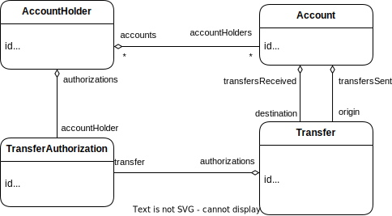
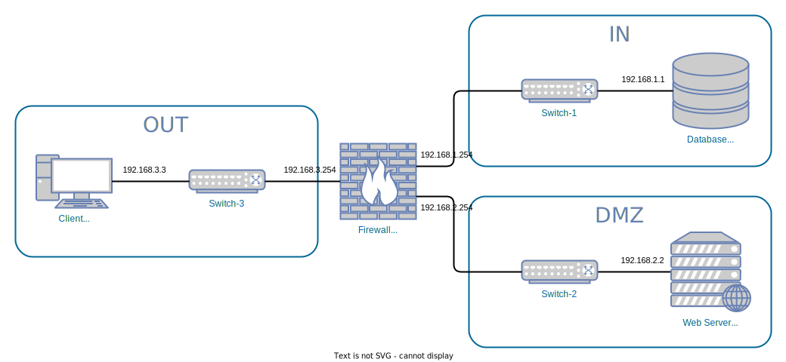
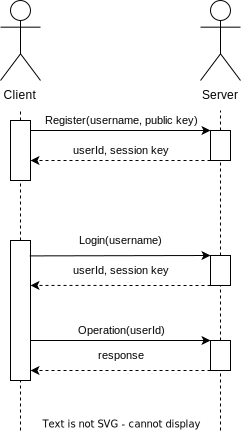

# BlingBank Project Report

## 1. Introduction

This document describes the organization of our project for the Network and Computer Security / Segurança Informática em Redes e Sistemas (SIRS) course.

Our business scenario is Insurance and Banking, where we were hired by a company called BlingBank to design an online banking platform, accessible via a web application, whose main functionalities are account management, expense monitoring, and simple payments.



*Class diagram of the project domain*

As we are talking of sensitive information, there were protection needs and security challenges that needed to be accounted for, and so the project development was divided in 3 main components: [Secure Document](#21-secure-document-format), [Infrastructure](#22-infrastructure), and [Security Challenge](#23-security-challenge).

In the first 2 components we were provided the folowing protection needs for the scenario:
- The protected document must ensure the authenticity and confidentiality of the account data.
- You can assume that the user and the service share a secret key.

Then later, we were provided the [security challeges](#23-security-challenge) that made us reformulate some mechanisms implemented in the previous components. 

## 2. Project Development

### 2.1. Secure Document Format

#### 2.1.1. Design

For the purpose of guaranteeing the security of the documents during the transmission, and according to the protection needs and security challenges of the business scenario, we implemented our own cryptographic library, called SecureDocuments.

Since the protection needs of the document were confidentiality and authenticity, our first instinct was to design an encryption/decryption system that envolved private and public keys from both ends of the communication, however we quickly realised that it would not be a good idea since a session key would provide the same property (`confidentiality`) as a public/private key pair (although to a lesser extend, as it is less secure) that were needed to answer the project requirements.

So we compromised and decided to use instead only the RSA key pair for the client, so it can assure `authenticity` and `non-repudiation` through the use of a signature.

There are two types of document encryption implemented, one used by the server and the other by the client:

**The Server**
-The server uses only a secret key to encrypt the documents he sends to the client, encrypting the file in a json field and then creating a message authentication code of the document, like the following:

```json
{
    "value":"+VLbgNxDARq4dOzumnaUMqrlavBr9k0bPtuW7yHUvAmwwOypjJJ/1Upe+RDSWyeEZNpqIfNmK+JfEI1IDhxuBol+sNp5RQQNNGNAKEjJPo4=",
    "timestamp":1703171053131,
    "mac":"8eFFcDszX8hsUh6l3m6ltQqLKp+7Y2G+ftetG0aE1t8="
}
```
*Caption*: the field `value` for the json document/key encrypted, `timestamp` for the freshness mechanism (later implemented for the security challenges) and a `mac` to ensure the integrity of the information.


**The Client**
-The client, on the other hand, uses his RSA key pair and a symmetric secret key to ensure all the properties previously mentioned, thus encrypting the file like the following one:

```json
{
    "value":"aOO/XSAqJVHhNOlAx35NBMPsEKKLOkzCqr9qJuebTkGtcOxU5d6n9u9hk8A+rNJi",
    "timestamp":1703259394960,
    "signature":"mrgbMxsLBCfnjxvo4ZYgiVLtKKNT70eSP2u4EU25poVoX8bWTOS5TSOBCK2SxwF3PkDcEQeGoT/d0sQTriPtqam6yKU7hUAa/EExhlVJWbCjG3YMAdsITwBL3m9ekYv0137YE2DdMHTNbmlsYoEip+W63FyyKBjUjRwQKv/Zw/P0uAnFSnSGbfsrqRnvE3V8ETGURKru4tjRM01TlleXLhYzIJlUYMbGuySiV0lCxdOwYkBYI/xsMKYtU9FdUIbcjzcb3jJ0aOcpevPpk3N6uwhjzUiPNVK7cOjXZFRS8yA1sjL5WLiOIl6XYVY4GS7hChXwycxTPKceMzFxVi+yCQ=="
}
```
*Caption*: the field `value` for the json document/key encrypted with the secret key, `timestamp` for the freshness mechanism (later implemented for the security challenges) and a `signature` to ensure the authenticity of the information and non-repudiation.

In sum the client uses a secret key to encrypt the document to be sent, and uses his private key to sign an assure the authenticity of communication. And the server communicates only using a secret key, sending the document encrypted with the secret key and a mac to ensure the documents integrity. 

#### 2.1.2. Implementation

The implementation of our system was progressive, with Java chosen as the programming language, to match the language chosen for both the frontend and backend of our application. The cryptographic libraries utilized were:

- [Java standard library](https://docs.oracle.com/javase/8/docs/api/java/security/package-summary.html), to allow the use of private/public key pairs.
- [javax.crypto](https://docs.oracle.com/javase/8/docs/api/javax/crypto/package-summary.html), to allow the use of secret keys.

The project's cryptographic library can be divided in 3 separate files:
- The class `SecureDocument.java` defines the interfaces for the protect and unprotect functions used by the server and client to encrypt and decrypt the documents sent by both parties. 
- The class `SecureDocumentCLI.java` contains the Secure Document CLI that is capable of being called in the terminal to encrypt/decrypt/check a given file.
- The class `SecureDocumentUtils.java` contains all the auxiliary functions that make the Secure Document cryptographic library work.

### 2.2. Infrastructure

#### 2.2.1. Network and Machine Setup

Our infrastructure comprises four virtual machines distributed across three virtual networks. One machine serves as a user terminal hosting the client application, another as our server, and a third as our database. To fortify the infrastructure, we employ an additional machine as the firewall.



*Network diagram*

For the firewall architecture, we opted for a "DMZ" (DeMilitarized Zone or screened subnet), establishing an extra subnet that exposes externally facing services in a more controlled manner. This introduces an additional layer of security to the internal subnet, and in our configuration, we utilize a single firewall DMZ model.

The firewall is employed to route connections from users to the server, ensuring that users only interact with the firewall's IP and never directly with the server. To achieve this, we utilize the Prerouting chain in the NAT table. Furthermore, we implement packet filters for precise control over incoming packets. Specifically, our rule set includes rejecting all packets in the input and output chains, while in the forward chain, only TCP packets between the database and server, and vice versa, or between the server and external IP, and vice versa, are accepted. Any other packets are dropped.

**Benefits:**
The singular firewall configuration minimizes resource utilization.

**Disadvantages:**
The single firewall setup poses a potential single point of failure for the network, as it is responsible for managing traffic for both the DMZ and the internal subnet.

#### 2.2.2. Server Communication Security

In our implementation there are two phases for a server-client connection: first the client and the server use the initial secret key to communicate (this is used to emulate an `Authentication Server`) and, after it has been established the identity of the user, the server generates a session key and sends it to the user to continue the communication, now using the session key.

We implemented communication through https for both `server-client` and `server-database` connections, using a simulated CA (we generated a key pair and a self-signed certificate) to sign the certificates for both the database and the server. 

We also implemented truststores for the client and for the server, although the server's truststore refered only to his connection to the database so it only stored the certificate of the CA and the certificate signed by the CA for the database, and the client's truststore only stores the CA certificate.

Finally, we also encryted the data stored in the database (with the exception of the ids) with an AES algorithm using an [attribute converter](https://github.com/tecnico-sec/a29-ivan-jorge-andre/blob/main/BlingBankServer/src/main/java/pt/tecnico/blingbank/server/config/AesEncryptor.java), so that only the server could be able to read the contents of the database.
 
### 2.3. Security Challenge

#### 2.3.1. Challenge Overview

For the security challenge, we were introduced 4 new requirements:

1. A new format for payment orders, that ensured confidentiality, authenticity and non-repudiation for each transaction.
2. Robust freshness measures, that ensured that a duplicate order would never be accepted.
3. A payment confirmation mechanism for accounts with multiple holders, that ensured authorization and non-repudiation from all owners before the payment order was executed.
4. A dynamic system for key distribution, to ensure all the previous requirements, especially non-repudiation, were fulfilled.

##### 2.3.1.1 Payment Order's Document Format

To answer the need for a secure format for payment orders, not much was changed from the [Secure Document](#21-secure-document-format) previous format, as we already ensured confidentiality through the use of a *secret key* encryption, authenticity and non repudiation through the use of a *signature*.

##### 2.3.1.2 Robust Freshness Measures

To ensure no duplicate transfer is executed, we implemented transfers in two steps:
1. The transfer is requested
2. The transfer is confirmed

The transer is executed once all account owners confirm the transfer, remaining as pending until then. Note that a confirmation is automatically sent by our client application from the account holder requesting the transfer.

For the first step, our secure document format employs a timestamp, limiting the scope of possible replay attacks to configurable interval.

For the second step, the user is required to send the transfer id and sign it. Due to the inherent uniqueness of transfer IDs, this process is fortified against replay attacks. This ensures that, at most, an attacker can generate a replicated transfer request, yet remains unable to authorize it.

##### 2.3.1.3 Payment Confirmation Mechanism

As our system allows for accounts with several holders, one of the challenges that arose with this functionality were the management of payment orders. 

To answer the non-repudiation requirement we decided to create a new class called [TransferAuthorization.java](https://github.com/tecnico-sec/a29-ivan-jorge-andre/blob/main/BlingBankServer/src/main/java/pt/tecnico/blingbank/server/domain/TransferAuthorization.java) that would be used to store a signature of a transfer confirmation order made by an user using it's private key, thus tying the holder to the order.

And, to answer the need for authorization from each owner, we created new operations for each client (we created confirm and cancel operations and pending transfers listing for a certain client). We also modified the Transfer object design to now have an attribute representative of the operation status and a list of transfer authorizations from the holders. The register transfer operation was also addapted to support all of the previous modifications.

##### 2.3.1.4 Dynamic Key Distribution

As we saw previously our system is very reliant on the management of the keys it uses, from confidentiality to non-repudiant, every security requirement needs a good mapping of every entity's keys.

So to solve this we decided to introduce a `keystore` for both the client and the server, using them for part of the key storage:
- The initial shared secret is stored on both the server and the client keystores.
- The session keys are stored in the client runtime memory, since it is only valid while the client is running, and in the server keystore.
- The client's private keys are generated during the register operation and stored in it's keystore alongside a selfsigned certificate.
- The client's public keys are shared to the server during the register operation and stored in the database, since they are not as confidential as the other keys.

Finally we implemented a `key management library` that provides all the needed functions to store and load the keys from the keystores, plus a function that generates `x509 certificates` for public-private key pairs.

#### 2.3.2. Attacker Model

**Trusted**: The machine housing the database is considered fully trusted, as it belongs to the internal subnet and is presumed to be under the bank's control.
Its inclusion in the internal subnet ensures a higher level of control and security.

**Partially Trusted**:The machine hosting the server is classified as partially trusted, residing in the DMZ and exposed to external traffic. Precautions are taken to mitigate potential risks.
he DMZ configuraton balances the need for external accessibility with security measures to safeguard against threats.

**Untrusted**: The machine representing the user client is deemed untrusted, situated within the external network, which inherently lacks control.
The external network, being less controlled, necessitates heightened vigilance due to potential security vulnerabilities.

We've identified specific attack vectors based on the target:

**Firewall Bypass**:
Target: The firewall machine.
Attempting to circumvent the firewall by exploiting misconfigurations or vulnerabilities.

**DMZ Vulnerabilities**:
Target: The DMZ subnet.
Exploiting vulnerabilities in services exposed to the external network.

**Denial of Service (DoS)**:
Target: The entire infratructure.
Overloading network resources or services to disrupt availability, particularly due to the single firewall setup.

We've also identified the inherent limitations of the attacker:

**Database Compromises**:
The database is well-secured within the network, and inputs are meticulously validated, preventing the likelihood of SQL injections. Additionally, the database is encrypted, adding an extra layer of security.

**Insider Threats**:
The absence of users with legitimate access to the internal subnet negates the possibility of insider threats.

**Cryptographic Strength**:
Our infrastructure is robustly fortified against attacks attempting to compromise our cryptography.

#### 2.3.3. Solution Design and Implementation

We extended the solution, by generating and sending the public key during the register operation.

The following diagram presents the information shared during *register* and *login* operations. Note that both those operations are encrypted using the initial secure document format with the shared secret. Further responses from the server are encrypted with the session key instead, while transfer requests/confirmation/cancelation are signed with tthe account holder private key.



*Sequence diagram of key distribution*

Most of the implementation is already documented under [Secure Document](#21-secure-document-format) and [Security Challenge](#23-security-challenge).

## 3. Conclusion

With this project, we conceptualized, built, and implemented a multi-layer infrastructure for an online banking system from the ground up. We assembled the entire infrastructure while ensuring its integrity against external attacks.

Although we are pleased with the results, we acknowledge that there are no perfect solutions. Therefore, we suggest some improvements that could enhance the system beyond the scope of the project. In terms of software, we recommend the actual implementation of logins with passwords and identity verifications. Additionally, we propose a "quality of life" update, allowing users to log in to their accounts from different computers.

Concerning infrastructure, we suggest allocating additional resources to accommodate the possibility of adding a second firewall. A system with two firewalls (one internal and one external) not only eliminates the risk of a single failure point but also helps distribute packet analysis, thereby improving network efficiency.

This project was significant for us as it provided hands-on experience in creating a system from scratch, attempting to isolate it from risks and attacks, and simultaneously reinforcing theoretical knowledge in a practical manner.

----
END OF REPORT
